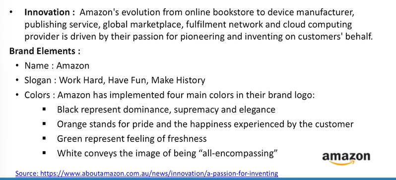

# Lecture 50: Brand Audit and Research

* Definition  
  - Brand audit is the comprehensive examination of a brand to discover its sources of brand equity - Keller et al, 2008

## Concept of Brand Audit

* External-oriented
* Customer-focused
* Assess the health of the brand
* Uncover the sources of brand equity
* Suggest ways to improve and leverage the brand equity

## Brand Audit Perspective

* A brand audit reguires understanding sources of brand equity
from the perspective of both the **firm** and the **consumer**.

* **The Firm perspective**
It is necessary to understand exactly what product and services
are currently being offered to the consumer and how they are
being marketed and branded.

* **The Consumer perspective**
It is necessary to dig deeply in their minds and tap perceptions
and beliefs to uncover the meaning of brands and products.

## Brand Audit Steps

The brand audit consists of two steps: the brand inventory and the brand
exploratory.  
1. **Brand Inventory** is to provide a current, comprehensive profile of how all the products and services sold by a company are marketed and branded.  

Brand inventory analysis includes the following descriptions:
1. The names, logos, symbols, characteristic, packaging, slogans, or other
trademark used.
2. The inherent product attributes or historical characteristics of the brand
and pricing, communications, distribution policies, and any other relevant
marketing activity related to the brand.

2. **Brand Exploratory** - 

Provide detailed information about what consumers think of the brand.  
Brand exploratory is reserach acitivity designed to identify potential
sources of brand equity.  

Activities that are useful for brand exploratory are :  
1. Reviewing past studies
2. Interviewing relevant personnel to get some insight.
3. Do qualitative and quantitave research for the wide range

## Brand Audit : Amazon

**Brand inventory**  
* **Product** : A variety of product classifications (Amazon Basic, Amazon Studios, Amazon Fresh, Amazon Kindle, Amazon warehouse, Amazon Prime, Amazon Student, Amazon Mom, One Click Service, Amazon Cloud Drive, Amazon Instant Video, Amazon App Store, Amazon Cloud Player, Amazon MP3, Amazon.com Rewards, Amazon Payments, Private label, Amazon Web Services,
Amazon Entrepreneur Store, Amazon Prime Air, Amazon Mayday, Amazon Publisher)
* **Pricing** : Amazon uses the "value pricing strategy" which is known as the every-day low pricing.
* **Distribution** : Online Channel: Significant cost benefit over other traditional distribution channels (Virtual delivery channel: Kindle, AmazonMP3 & Cloud Player, Amazon Cloud drive)
  * Physical Channel: Half million square feet storage capacity in distribution centers
  * Amazon's Next-Day and Same-Day Guaranteed delivery services
  * 34 fulfilment centers with more than 61 million cubic feet of storage capacity.

Link - https://www.aboutamazon.com.au/news/innovation/a-passon-for-inventing

**Brand Exploratory:**. 
  * Customer-centric online retailer in the world.
  * "Reliable, secure, trustworthy, customer-centric, fast, convenient with variety"
  * Amazon's brand resonance pyramid is well structured, and that there is a great
level of correlation between the rational side and the emotional side.
  * A very wide offering of products and multiple brand extensions place Amazon
competitively in industries involving web & data services (B2B, B2C), consumer
technology, multimedia hosting and streaming, booksellers, catalog-based retail,
and more.

## Objectives of Brand Research

Brand research aims to identify the processes by which brands create
value and develop a portfolio of methodologies for measuring the market
impact of a brand.  
Major objectives of Brand Research are:  
1. Assess customer perception about brand  
2. Assess brand health
3. Assess brand competition
4. Assess brand potentials
5. Assess market opportunities
6. Evaluate brand innovation

> Also I tried to mention on that you if you want to understand that how to reach to heart of someone especially customers then definitely you must understand a reflexive approach, reflexive research approach. 

