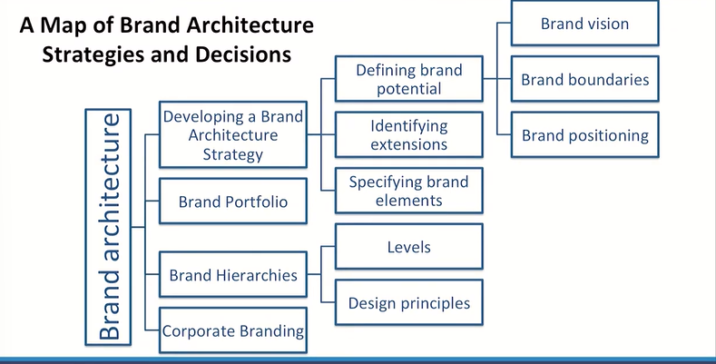
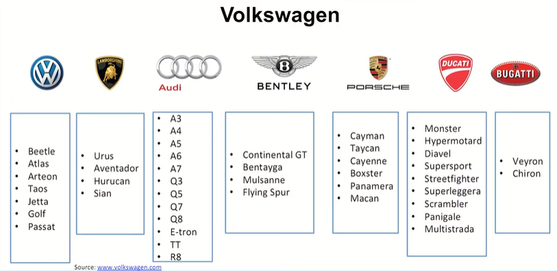
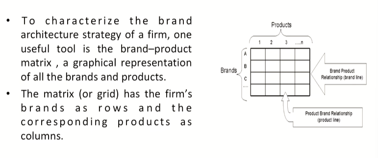
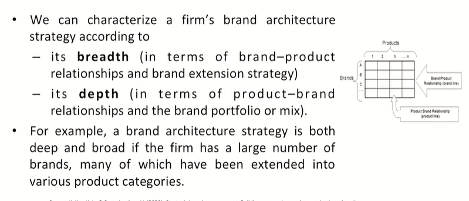
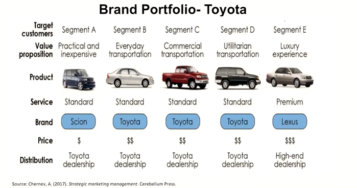
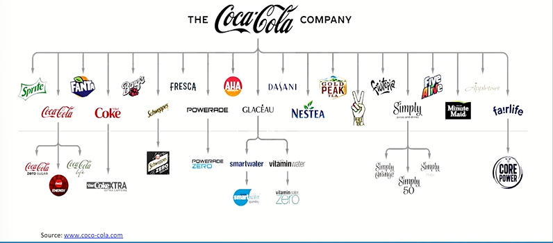
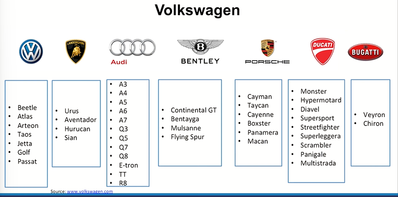

# Lecture 51: Brand Architecture Strategies And Brand Portfolio

## A Map of Brand Architecture Strategies and Decisions

## Developing a Brand Architecture Strategy

* The firm's brand architecture strategy helps marketers determine which products and services to introduce, and which brand names, logos, symbols, and so forth to apply to new and existing products.
* The role of brand architecture is twofold:
  * **To clarify brand awareness:** Improve consumer understanding and communicate similarity and differences between individual products and services.
  * **To improve brand image:** Maximize transfer of equity between the brand and individual products and services to improve trial and repeat purchase.
* Developing a brand architecture strategy requires three key steps:
  * Defining brand potential- in terms of its "market footprint"
articulating vision
    * defining brand boundaries
    * crafting brand positioning
  * Identifying brand extension opportunities
  * Branding new products and services

## Volkswagan Brand Architecture

* **Goal** - "to offer attractive, safe and environmentally sound vehicles which can compete in an increasingly tough market and set world
standards in their respective class."
* **Vision**- "to make this world a mobile, sustainable place with access to all the citizens."
* **Core values**- "accountability, teamwork, servant's attitude, and
integrity."
* **The guiding principle:** The development of sustainable, connected, safe and tailored mobility solutions for future generations.

* **New Group strategy** "NEW AUTO - Mobility for Generations to Come"- The Volkswagen Group will be a significant driver of this transformation and accelerate its realignment from vehicle manufacturer to a leading,
global software-driven mobility provider.
* **Alignment** - The Volkswagen Group is rigorously realigning itself and building up the new competencies. In addition to software development and the capability for autonomous driving, this also applies to areas such
as battery technology, battery recycling, charging infrastructure and mobility services.

## The Brand-Product Matrix

## Category

* The rows of the matrix represent **brand-product relationships.**
* They capture the firm's brand-extension strategy in terms of the number and nature of products sold under its different brands.
* A **brand line** consists of all products-original as well as line and category extensions-sold under a particular brand. Thus, a brand line is one row of the matrix. (Note: A product line may include different brands, or a single-family brand or individual brand that has been line extended.) E.g., SOFT DRINKS, JEWELLERY, SKIN CARE, DENTAL CARE
* We want to judge a potential new product extension for a brand on how effectively it leverages existing brand equity from the parent brand to the new product, as well as how effectively the extension, in turn, contributes to the equity of the parent brand.
* Given that product policy has been set for a firm in terms of product boundaries (i.e., appropriate product categories and product lines), then the proper branding strategy must be decided upon in terms of which brand elements should be used for which products.
* Decisions must be made as to which products to attach to any one brand as well as how many brands to support in any one product category.
* The former decision concerns brand extensions; the latter decision concerns brand portfolios.
* The **columns** of the matrix represent **product-brand relationships.**
* They capture the brand portfolio strategy in terms of the number and nature of brands to be marketed in each product category.
* The **brand portfolio** is the set of all brands and brand lines that a particular firm offers for sale to buyers in a particular category.
* Thus, a brand portfolio is one column of the matrix. Marketers design and market different brands to appeal to different market segments.

## Brand Portfolios

* A **brand portfolio** includes all brands sold by a company in a product
category.
* Brands can play a number of specific **roles** as part of a brand portfolio
  * To attract a particular market segment not currently being covered by other brands of the firm.
  * To serve as a flanker and protect flagship brands.
  * To serve as a cash cow and be milked for profits.
  * To serve as a low-end entry-level product to attract new customers to the brand franchise.

* To serve as a high-end prestige product to add prestige and
credibility to the entire brand portfolio.
* To increase shelf presence and retailer dependence in the store.
* To attract consumers seeking variety who may otherwise have
switched to another brand.
* To increase internal competition within the firm.
* To yield economies of scale in advertising, sales, merchandising, and
physical distribution.

