# Lecture 52: Brand Portfolio And Brand Hierarchies

## Single-Brand Portfolios Strategies

* Single-brand strategy (also referred to as umbrella branding or branded
house) involves using the same brand across diverse offerings.
  * **For example, BMW, Mercedes, Heinz, and FedEx use a single brand for nearly all their products and services.**
* Companies using a single-brand strategy differentiate the individual
offerings by using generic designators rather than brands.
  * **For example, Mercedes uses letters, BMW uses numbers, and GE combines the GE brand with common words such as aviation, healthcare, power, oil and gas, and transportation to reference the individual offerings in their company portfolios. Source: Chernev, A. (2017). Strategic marketing management. Cerebellum Press.**

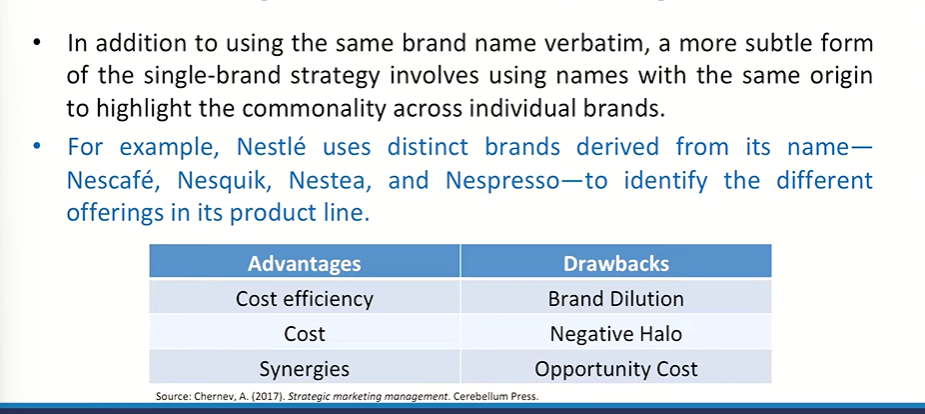

## Multi-Brand Portfolios Strategies

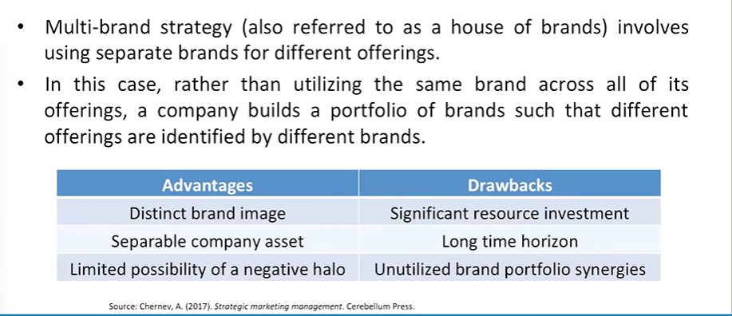

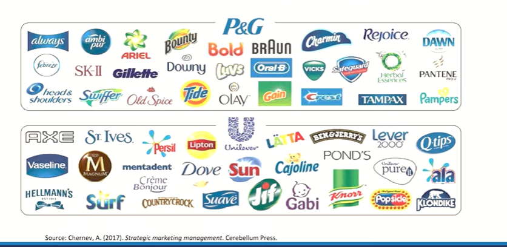

## Brand Hierarchies

* A brand hierarchy is a useful means of graphically portraying a firm's
branding strategy by displaying the number and nature of common and
distinctive brand elements across the firm's products, revealing their
explicit ordering.
* It is based on the realization that we can brand a product in different
ways depending on how many new and existing brand elements we use
and how we combine them for any one product.

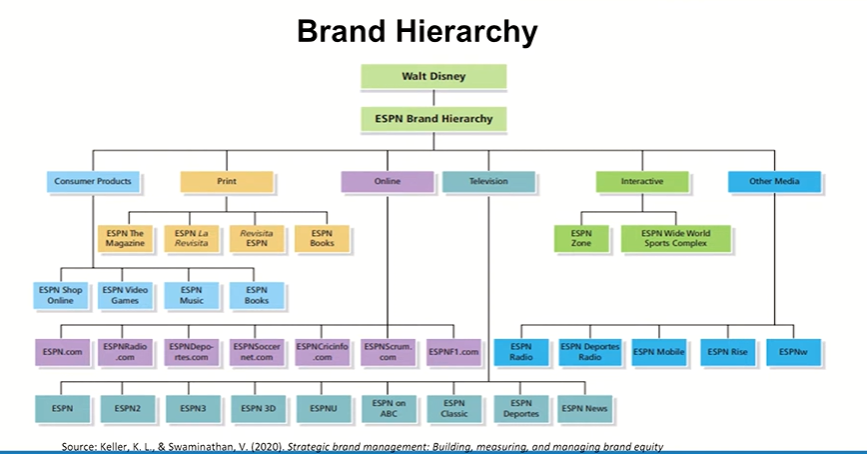

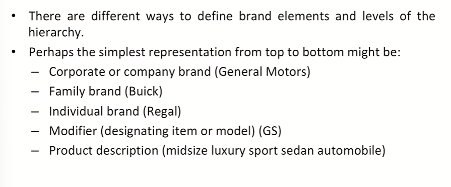

## Guidelines for Brand Hierarchy  Decisions

* **Decide on which products are to be introduced.**
  * **Principle of growth:** Invest in market penetration/acceptance or expansion vs. product development according to ROI opportunities. (Cisco decided to bet big on new Internet video products. Cisco launched Telepresence technology to permit high-definition videoconferencing for its corporate customers and is infusing its entire product line with greater video capabilities through its medianet architecture.)
  * **Principle of survival:** Brand extensions must achieve brand equity in their categories.
  * **Principle of synergy:** Brand extensions should enhance the equity of the parent brand.

* **Decide on the number of levels.**
  * **Principle of simplicity:** Employ as few levels as possible.
  * **Principle of clarity:** Logic and relationship of all brand elements
employed must be obvious and transparent.
* For e.g., A complex set of products-such as cars, computers, or other
durable goods-requires more levels of the hierarchy. Thus, Sony has
family brand names such as Cyber-Shot for its cameras, Bravia for TVs,
and Handycams for its camcorders.

* **Decide on the levels of awareness and types of associations to be created at each level.**
  * **Principle of relevance:** Create abstract associations that are relevant
across as many individual items as possible. For example, Nike's
slogan ("Just Do It") reinforces a key point-of-difference for the
brand-performance-that is relevant to virtually every product it
sells.
  * **Principle of differentiation:** Differentiate individual items and brands.

* **Decide on how to link brands from different levels for a product.**
  * **Principle of prominence:** The relative prominence of brand elements
affects perceptions of product distance and the type of image created
for new products.
  * *Kellogg adopts a sub-brand strategy that combines the corporate
name with individual cereal brands, for instance Kellogg's Corn Flakes
and Kellogg's Special K. Through its sub-branding strategy and
marketing activities, Kellogg should be effective, as a result, in
creating favorable associations to its corporate name.*

* **Decide on how to link a brand across products.**
  * **Principle of commonality:** The more common elements products share, the stronger the linkages.
  * *For e.g., Donald's has used its "Mc" prefix to introduce a number of products, such as Chicken McNuggets, Egg McMuffin, and the McRib sandwich.*

Let's look at this again

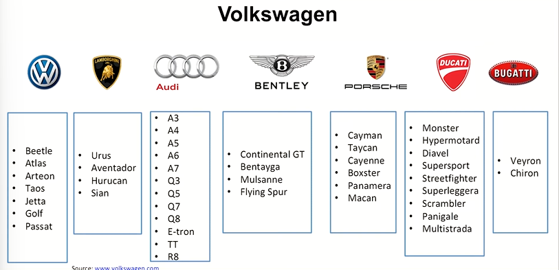

## Corporate Branding

* The highest level of the hierarchy technically always consists of one
brand-the **corporate or company brand.**
* Corporate brand equity is the differential response by consumers,
customers, employees, other firms, or any relevant constituency to the
words, actions, communications, products, or services provided by an
identified corporate brand entity.
* For some firms like *General Electric and Hewlett-Packard*, the corporate
brand is virtually the only brand.
* We can think of a corporate image as the consumer associations to the
company or corporation making the product or providing the service.

> Product is the reflection of the Organization vision

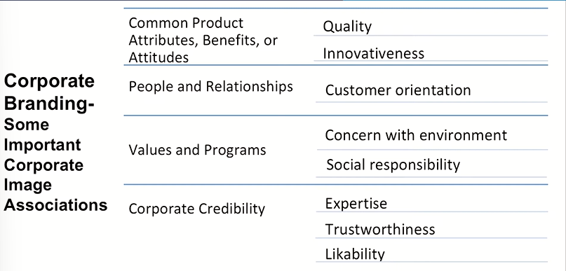

## Corporate Branding - The TATA Group

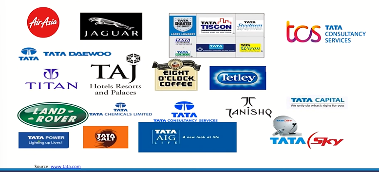

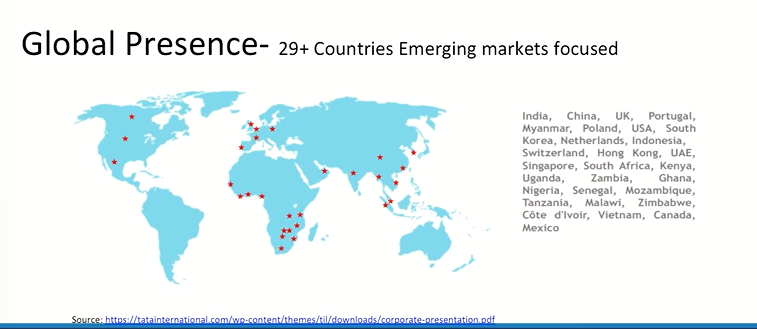

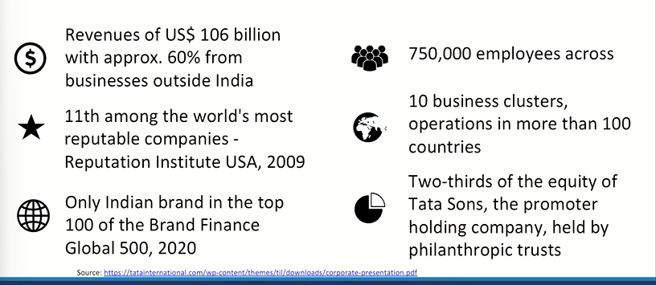

* Values- Pioneering, Integrity, Excellence, Unity & Responsibility
* Values of TATA group reflect in J.R.D Tata's statement for value that
'what comes from the people should go back to the people many times
over'.
* The values exert influence in three ways.
  * First, they influence strategy, including brand strategy at both the
group and the independent company levels.
  * Second, they influence individual actions and behaviours.
  * Third, the values also directly influence stakeholder perceptions.

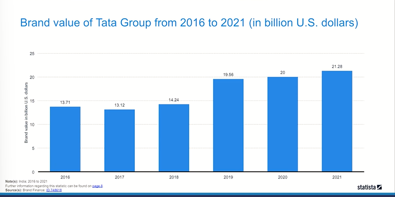

## Corporate Innovation at 3M -- A Brand known for Innovation

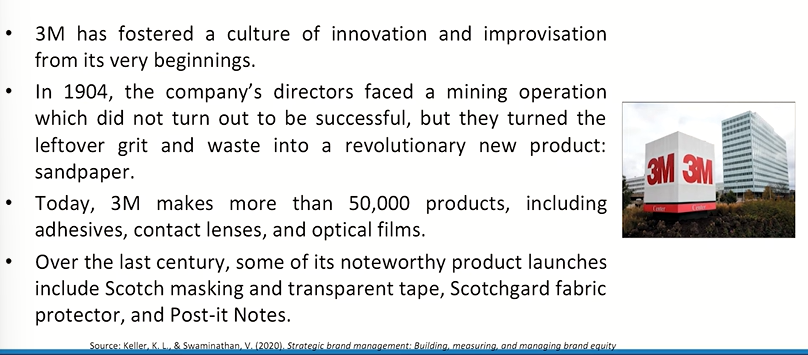

* The firm is able to consistently produce innovations in part because it
promotes a corporate environment that facilitates new discoveries:
  * 3M encourages everyone, not just engineers, to become product
champions. The company's "15 percent time" lets all employees
spend up to 15 percent of their time working on projects of
personal interest.
  * 3M hands Golden Step awards each year to the venture teams whose new products earned more than $2 million in U.S. sales or $4million in worldwide sales within three years of commercial introduction.
* 3M is very selective about acquisitions, seeing them as only supplementary to
organic growth and internal innovations and developments.
* Starting in 2010, 3M has introduced social networks into its innovation
process, inviting 75,000 global employees and more than 1,200 other people
to participate in its annual Markets of the Future brainstorming session. More
than 700 new ideas were generated, leading to nine new markets for the
company to explore.
* Some of the innovations that 3M focused on in 2017 include utilizing
Information and Communications Technologies (ICTs) to foster innovation,
economic growth, and progress, helping Western Europe achieve the Industry
4.0 plan.