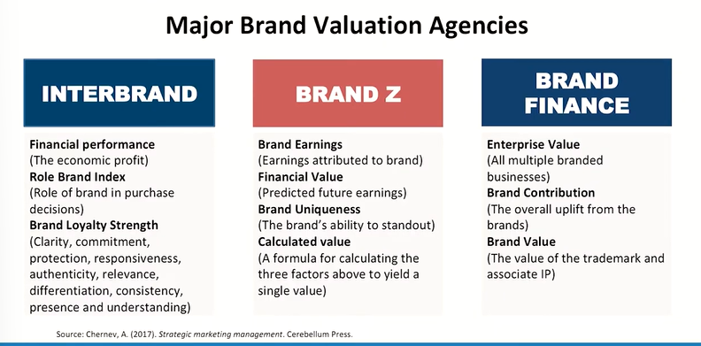
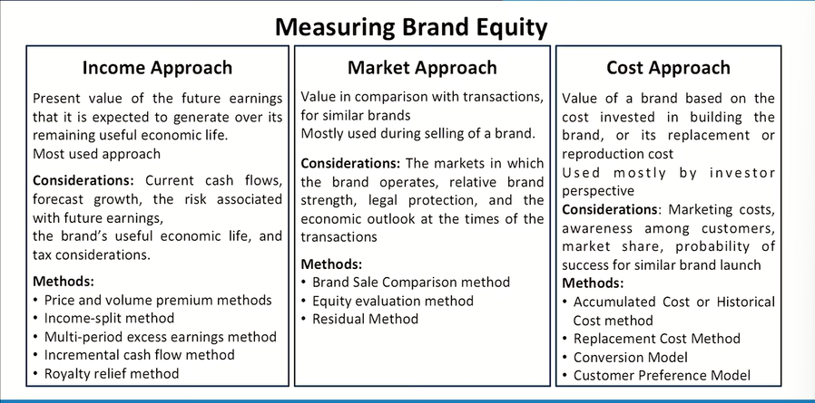

# Lecture 54: Brand Equity: Measuring Outcomes- 2

## Major Brand Valuation Agencies

## Measuring Brand Equity

### 1. Income Approach

1. **Price premium method** - estimates the value of a brand by the price premium
it generates when compared to a similar but unbranded product or service.
This must take into account the volume premium method.

2. **Volume premium method** - estimates the value of a brand by the volume
premium it generates when compared to a similar but unbranded product or
service. This must take into account the price premium method.

3. **Income split method** - this values the brand as the present value portion of theeconomic profit attributable to the brand over the rest of its useful life. This has problems in that profits can sometimes be negative, leading to unrealistic
brand value, and also that profits can be manipulated so may misrepresent brand value. This method uses qualitative measures to decide the portion of economic profits to be accredited to the brand.

4. **Multi-period excess earnings method** - this method requires a valuation of each group of intangible assets to calculate the cost of capital of each. The returns for each of these are deducted from the present value of future cash flows and when all other assets have been accounted for, the remaining is used as the value of the brand.
5. **Incremental cash flow method or Excess Margin** - Identifies the extra cash flow in a branded business when compared to an unbranded, and comparable, business. However, it is rare to find conditions for this method to be used since finding similar unbranded companies can be difficult.
6. **Royalty relief method** - Assume theoretically a company does not own the brand it operates under but instead licenses the use from another. The royalty relief method uses available data of similar arrangements in the industry and assigns the value of
the brand as the present value of future royalty payments.

### 2. Market Approach

* **Brand Sale Comparison method:** This approach entails the valuation of the brand by observing current transactions concerning similar brands in a similar industry
and referring to similar multiples.
* In other words, this approach takes the premium (or some other measure) that has been paid for similar brands and applies this to brands that the company owns.
* The benefit of this method is that it appears at a 3rd party angle that is, what the
third party is willing to pay and is easy to calculate.
* However, the flaw in this approach is that the information for similar brands is rare and the price paid for the same brand consists of the synergies and the specific goals of the buyer and it may not be relevant to the value of the brand at issue.

* **Brand Equity based on Equity Evaluation method** - Brand equity may be divided into components: The '**demand enhancing component**, which incorporates advertising and results in rate premium profits, The cost-benefit component, which is acquired due to the brand during new product introductions and through economies of scale in distribution.
* Hence, they essentially anticipated the price of brand equity using the financial market value and the benefit of this method is that it is based on empirical proof.
* However, shortfalls of this method are that it assumes a very sturdy state of efficient marketplace hypothesis and that all information is covered in the share price.

* **Residual Method** - Keller has proposed the valuation of the brand by residual value which might be when the marketplace capitalization is subtracted from the net asset value.
* It will be the value of the 'intangibles' one of which is the brand. Another alternative method that is advised is that of the utilization of real options.
* The variables that need to be calculated are the risk-free interest rate, implied volatility (variance) of the underlying asset, the modern-day exercise rate, the value of the underlying asset, and the time of expiration of the option.
* This approach is beneficial in calculating the potential value of line extensions however the inherent assumptions in this method make any practical application hard.

### 3. Cost Approach

* **Accumulated Cost or Historical Cost method:** It aggregates all the historical marketing costs as the value (Keller 1998).
* In other words, the method involves historical cost of creating the brand as the actual brand value.
* It is often used at the initial stages of brand creation when specific market application and benefits cannot yet be identified.
* **Replacement Cost Method:** The Replacement Cost Method values the brand considering the expenditures and investments necessary to replace the brand with a new one that has an equivalent utility to the company.
* Aaker (1991) proposed that the cost of launching a new brand is divided by its probability of success.

* **Conversion Model:** Using the method here, one estimates the amount of awareness that needs to be generated in order to achieve the current level of sales.
* This approach would be based on conversion models, i.e., taking the level of awareness that induces trial that further induces regular repurchase.
* **Customer Preference Model:** Aaker (1991) proposed that the value of the brand can be calculated by observing the increase in awareness and comparing it to the corresponding increase in the market share.
* But there is one flaw in this model, it assumes a linear function between awareness and market share.