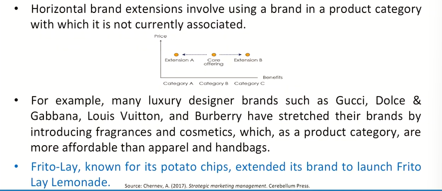
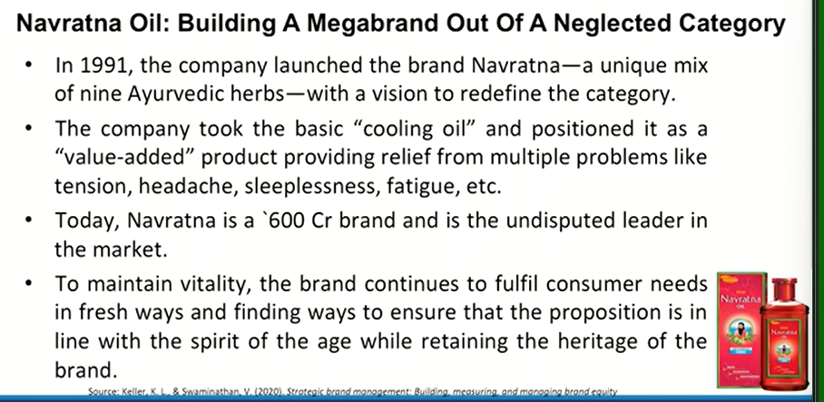

# Lecture 55: Brand Extension

* Brand extension refers to the strategy of stretching the meaning of a
brand by associating it with a type of offering that the brand has not
been associated with in the past.
* For example, Starbucks, which has become synonymous with coffee,
extended its brand to include ice cream sold in grocery stores.
* When a firm introduces a new product, it has three choices for branding it:
    * It can develop a new brand, individually chosen for the new product.
    * It can apply one of its existing brands.
    * It can use a combination of a new brand and an existing brand.

* A brand extension occurs when a firm uses an established brand name
to introduce a new product (approach 2 or 3).
* When a new brand is combined with an existing brand (approach 3), the
brand extension can also be a **sub-brand.**
* An existing brand that gives birth to a brand extension is the **parent
brand.**
* If the parent brand is already associated with multiple products through
brand extensions, then it may also be called a **family brand.**

## Vertical Brand Extensions

* Vertical brand extensions stretch the brand to a product or service in a different price tier.
* Depending on the direction in which the brand is being extended, there are two types of vertical brand extensions:
    * **upscale extensions** in which the brand is associated with an offering in a higher price tier. *For e.g., Apple extended its product line with the Apple Watch Edition series featuring 18-karat gold and priced between $10,000 and $17,000.*
    * **downscale extensions** in which the brand is associated with an offering in a lower price tier. *For e.g., Maserati introduced Ghibli, a basic version of its high-end sports cars.*

## Horizontal Brand Extensions

## When to Extend a Brand

* The primary reason to extend an existing brand is to leverage its power to support a new offering.
* As building a new brand is a costly and time-consuming task that carries risk related to its ultimate success, the decision to extend an existing brand should involve considering several key factors:
  * offering relevance
  * brand impact
  * market opportunity
  * company goals and resources.

## Navratna Oil : Building a Megabrand Out of a Neglected Category

* To counter the media challenges, the brand took several
initiatives including:
    * Apt use of celebrities to break the clutter and establish its name.
    * Below the Line (BTL) communication to clearly establish and promote the product benefit and experience in media markets.
    * Established a strong identifier "Thanda Thanda Cool Cool" to clearly differentiate itself from the other players and own the 'cooling' space.

* The brand has always endeavored to use compelling insights to its advantage to unlock category potential. Some of the steps which helped in opening up opportunities include:
    * Launched Navratna oil in sachets to offer convenience and generate trials.
    * Roped in regional celebrities for support in developing other markets.
    * Launched variants to meet specific-need gaps in the cooling oil space.
    * Extended its core benefit to the talcum powder category with the launch of Navratna Cool Talc.

## Royal Enfield

* Classic 350
* Meteor
* Interceptor 650
* Continental GT
* Himalayan
* Bullet
  * Bullet 350
  * Bullet ES
* Apparerls
* Motorcycle Accessories other Services and Visit their Showrooms/Outlets

## Brand Extension - Advantages

. Facilitate New Product Acceptance  
. Improve brand image  
. Reduce risk perceived by customers  
. Increase the probability of gaining distribution and trial  
. Increase efficiency of promotional expenditures  
. Reduce costs of introductory and follow-up marketing programs  
. Avoid cost of developing a new brand  
. Allow for packaging and labeling efficiencies  
. Permit consumer variety-seeking  

## When is Variety a Bad Thing?

* Today, consumers face an unprecedented number of choices.
* Take toothpaste. A supermarket can stock over 100 varieties depending
on brand name (Colgate, Close-up, Patanjali, Pepsodent), benefits (tartar
control, whitening, breath freshening, sensitive gums), flavors (regular,
mint, cinnamon, citrus), and forms (gel, paste).
* Actually, finding the optimal choice can require much effort and result in
inner conflict and regret.
* Reducing the number of different items stocked does not necessarily
adversely affect category volume, especially if the category already has a
lot of (Stock-Keeping Units)SKUs or a few SKUs that are big sellers.
* Research has also found that consumer perceptions of variety
assortment depend on factors such as the similarity of items for the
brand, the amount of allocated shelf space, and the presence of the
consumer's favorite item.
* Marketers and retailers can improve perceptions of product variety in a
category or for a brand.
* For example, organized displays have been found to be better for large
brand assortments, whereas unorganized displays are better for small
brand assortments. Asymmetrical assortments-in which some items for
a brand appear more frequently than others-have also been found to
lead to perceptions of greater assortment.