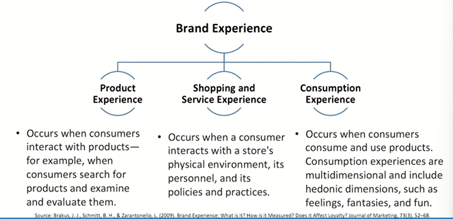
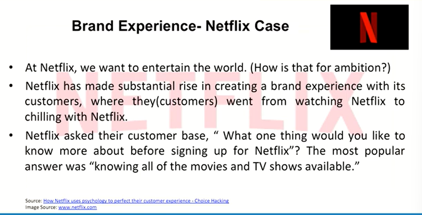
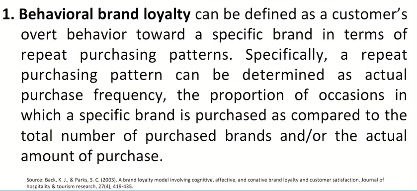
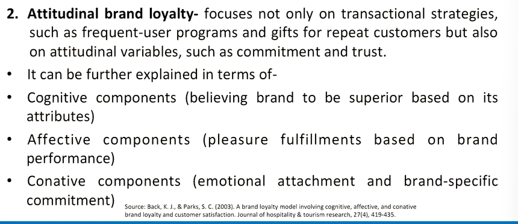
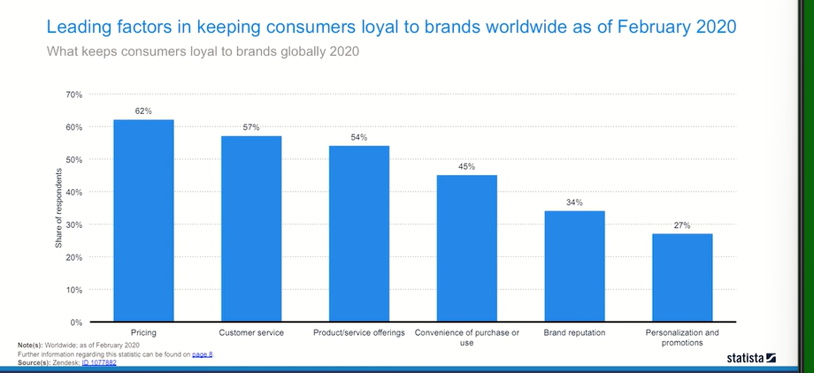

# Lecture 56: Brand Experience & Brand Loyalty

## Brand Experience



## Brand Experience - Netflix Case



* In response, Netflix experimented with showing customers available
content on the home page. But their experiment revealed something
interesting. Showing customers too much of the content was distracting.
Many of them browsed but never signed up.
* So, Netflix redesigned their experiment. Designers still used the
Reciprocity Principle, but this time they used an image that hinted at an
extensive catalog.
* But they didn't let customers browse the whole thing. Giving people a
sneak peek - but not the total view - made customers more likely to
sign up for a free streaming trial.

**Source**: How Netflix uses psychology to perfect their customer experience - Choice Hacking  

* Netflix keeps their customers engage:
  - By providing personalized content by knowing customers' previously-played history.
  - Their experience forces customers' to watch trailers that auto-play
when they dwell on the title. This feature is a source of frustration
for many customers, but the benefits of Idleness Aversion have
clearly outweighed the costs for Netflix.
* Netflix knows how to create buzz: (Refer to-How Netflix India created
buzz around Kota Factory's season 2 launch by leveraging Jeetu Bhaiya's
fanbase).

## Conceptualizing Brand Experience

* Brand experience can be conceptualized as subjective, internal
consumer responses (sensations, feelings, and cognitions) and
behavioral responses evoked by brand-related stimuli that are part of a
brand's design and identity, packaging, communications, and
environments.
* Brand experience is related but also conceptually distinct from other
brand constructs. In particular, brand experience differs from evaluative,
affective, and associative constructs, such as brand attitudes, brand
involvement, brand attachment, customer delight, and brand
personality.

## Differences between Brand Experience and other Brand Constructs

* **Attitudes** are general evaluations based on beliefs or automatic
affective reactions (e.g., "I like the brand").
* In contrast, **brand experiences** include specific sensations, feelings,
cognitions, and behavioral responses triggered by specific brand-related
stimuli.
* For example, experiences may include specific feelings, not just an
overall "liking."
* However, the overall attitude toward the experience captures only a
small part of the entire brand experience.
* Brand experience also differs from motivational and affective concepts,
such as **involvement**, brand **attachment**, and customer **delight**.
* **Involvement** is based on needs, values, and interests that motivate a
consumer toward an object (e.g., a brand).
* Brand experience does not presume a motivational state. Experiences
can happen when consumers do not show interest in or have a personal
connection with the brand. Moreover, brands that consumers are highly
involved with are not necessarily brands that evoke the strongest
experiences.
* In contrast to **brand attachment**, *brand experience is not an emotional
relationship concept*. Over time, brand experiences may result in
emotional bonds, but emotions are only one internal outcome of the
stimulation that evokes experiences.
* Customer delight results from disconfirming, surprising consumption.
* In contrast to **customer delight**, *brand experiences do not occur only
after consumption*; they occur whenever there is a direct or indirect
interaction with the brand.
* Moreover, a brand experience does not need to be surprising; it can be
both expected or unexpected.
* Brand experience is distinct from **brand association.**
* One of the most studied constructs of brand associations is brand
personality.
* **Brand personality** is based on inferential processes. That is, consumers
are not sincere or excited about the brand; they merely project these
traits onto brands.
* In contrast, brand experiences are actual sensations, feelings,
cognitions, and behavioral responses.

## Loyality

* Commitment  
* Faith  
* Unconditionally  
* Non Deniability - I accept but I do not deny as well

> I will not be taking you into whole lot of you know Psychological aspects of these elements but loyalty just briefly, can be seen with reference to imagine that with whom you have been, you know, loyal to with what you have been loyal to. Have you been loyal to your physical fitness, let us say, have you been loyal to you know? Your you know health of your teeth or those kind of things. So these are, these are the aspects you have been loyal to and same can be traverse in terms of brand loyalty as well.


## Brand Loyality

* Brand loyalty is a situation in which a consumer
generally buys the same manufacturer-originated
product or service repeatedly over time rather than
buying from multiple suppliers within the category.
* It is the *degree to which a consumer consistently
purchases* the same brand within a product class.
(Substitutable Products)

## Types of Brand Loyality






## Brand Loyality - Multidimensional Perspective

* Brand loyalty is not limited to situations where a behavioral response in
terms of buying the brand is necessary to measure brand loyalty.
Consumers may be brand loyal even though they may have never
bought the brand or the product.
* Even when brand loyalty is based on repetitive buying behavior, it is believed the consumer, or the buyer may have no evaluative (cognitive or attitudinal) structure underlying his brand loyalty. However, it is often possible to observe emotive tendencies (affect, fear, respect, compliance, etc.) concomitant with the behavioral brand loyalty.


* Imp
```txt
There are several textbooks which talk about
these aspects along with the help of my team
often try to bring in some contemporary
researches published in good journals for you
as well, so as to give you a composite view of
how to look at these aspects. Because to be A
practitioner one must remember that we must
understand how researches are exemplifying
or theoritizing on, you know, theorizing on
several kinds of elements
```

* Brand loyalty can exist at the nonbehavioral level (emotive or evaluative
level) for those products or services which same consumers never buy.
* Brand loyalty needs to be distinguished in the mind of the consumer
based upon the specific role he performs with respect to the brand.
* Different types of brand loyalty is believed to be prevailing for different consumers and for different product classes. In other words, the typology of brand loyalty is a function of product and consumer differences.



```txt
So see that is that is an interesting kind of a thing
basically because as brand managers we have
to wonder.
How customer would, why customer would
remain loyal to us, how customer would be
kept loyal to to us? Basically what can be done
because the kind of marketing programs we
are generating probably are similarly being
generated by other competitors as well. And
when we are talking of you know, matured
competition, when we are talking of strong
competition, so similar kinds of approaches
are there basically they also have intelligent
teams. They also have you know learned
teams. They also have so much of Al database
with them. So there is an element to it. So
many a times we have to wonder on the
factors.
```

## Brand Loyality Examples

* If you like Jeep, Mustang, or Tesla today, you're incredibly likely to like that brand tomorrow, according to newly released consumer data from IHS Markit.
* IHS Markit has been tracking customer loyalty for over two decades and Tesla nabbed three spots on the 25th annual loyalty list.
* Other brands that were named top loyalty winners include GM (overall
loyalty to manufacturer), Ford (overall loyalty to make) and Lincoln
(overall loyalty to dealer). Alfa Romeo was named the most improved
loyalty to make, and Genesis won the highest conversion of conquests
to loyalists.

## Few other examples are - Brand Loyality

* Football clubs- Manchester United, Barcelona etc.
* Coco-Cola
* Disney
* Google
* Dominos
* Apple
* Netflix
* Patanjali

```txt
I'll leave you with this word, loyalty, which is
not only desire.
While huge you know base of brand loyal
customers and I'll, I'll leave you with this word
loyalty which is not only desirable but if is
gained by brands then probably many things
you know can be subsided.
As as far as efforts go and loyalty may drive
the brand to an extent on its own basis by
itself. I will be coming back to you with.
```