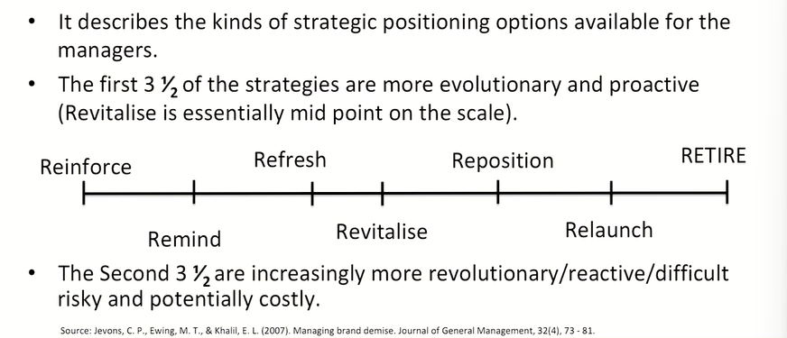
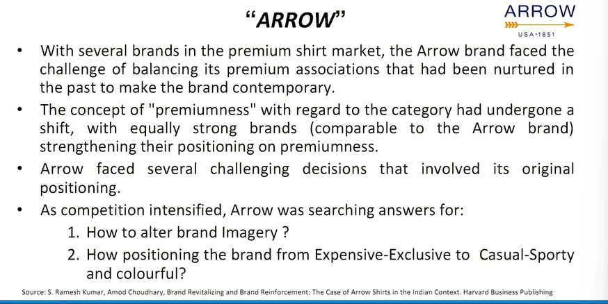
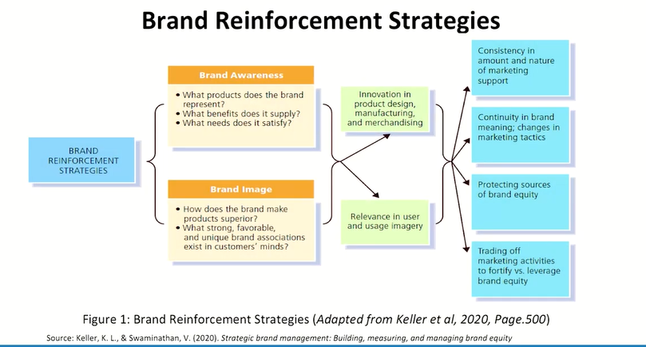
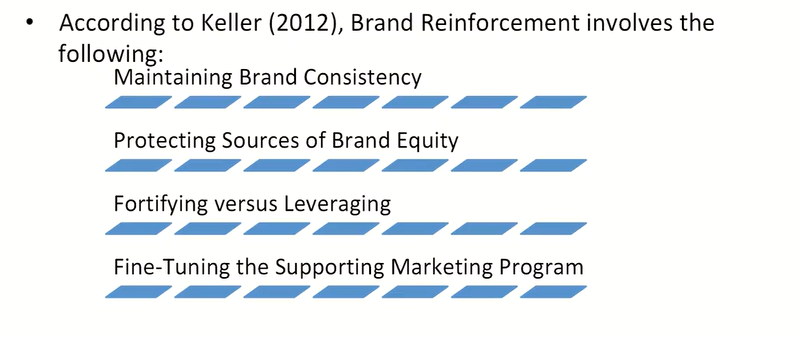

# Lecture 57: Brand Continuum & Brand Reinforcement

## Brand Management Continuum

* **Reinforcement** and **Remind** Strategy focuses on reminding the customers **why they like (and use) the brand**. The firm is saying nothing fundamentally new, simply
repeating and reiterating existing marketing messages.
* **Refresh** involves giving customers new reasons to continue using the brand: without
fundamentally changing the positioning. For e.g., Coco Cola.
* **Revitalise** refers to the set of activities a brand undertakes to stay relevant in changing the environment.
* **Reposition** is a radical strategy, it is often required (for various reasons, some of the firms making, others in response to the market forces and/or competitors' actions).
For e.g., Dabur
* **Relaunch** is an even more extreme strategy with limited success rate. For e.g., Maggi
* **Retire** is a strategy where the firm voluntarily culls the brand. For e.g., Orkut (Google)

## Arrow

### Managing Arrow "Best is yet to come"

* The brand is manufactured and marketed by Arvind Brands had the
tagline **"The Finest Shirt You'll Ever Put On; Authentic American style"**
earlier. The present tagline is " When You Know"
* **Improved Brand Image:** Arrow switched over the focus to "lifestyle"
rather than just a merchandise and their marketing communications
projected lifestyle images to strengthen positive image.
* **Improved Brand Awareness:** Started new line of casual clothing and the
brand extended new line of products 'Arrow Women' and they also
entered the footwear market.
* Increased the distribution channel and points and extended tie ups with
e-commerce websites to increase visibility and sales.

## Brand Reinforcement

* Marketers must actively manage brand equity over time by reinforcing
the brand meaning and, if necessary, by adjusting the marketing
program to identify new sources of brand equity.
* Brand reinforcement includes regular monitoring of a product at all the
levels of product life cycle (viz. Introduction Stage, Growth Stage,
Maturity Stage and Decline Stage) to keep a check on the changes in
the tastes and preferences of customers.
* Brand equity can be strengthened by marketing initiatives that
continuously communicate the brand's relevance to customers in
terms of **brand awareness** and **brand image.**

* Mahindra
* TATA
* HERO
* LG
* and the list is long

## Brand Reinforcement Strategies

## Maintaining Brand Consistency

* Brand consistency leads consumers to get familiarized with the brand and enhance their perception about brand uniqueness, resulting in brand reputation.* Brands with shrinking research and development and marketing communication budgets run the risk of becoming technologically disadvantaged.
* **Market leaders and failures:** Inadequate marketing support is an especially dangerous strategy when combined with price increases. An example of failure to adequately support a brand occurred to Pan American World Airways, Compaq PC
* **Consistency and change:** Managing brand equity with consistency requires making numerous tactical shifts and changes in order to maintain the strategic thrust and direction of the brand. The most effective tactics for a particular brand at any one time varies.
* The strategic positioning of many leading brands has been kept uniform over time by the retention of key elements of the marketing program and the preservation of the brand meaning. For e.g., **Dettol Antiseptic soap.**

## Protecting Sources of brand Equity

* Though brand should always try to defend the existing sources of
brand equity, they should also look for potentially powerful new
sources of equity.
* However, there is very little need to deviate from a successful
positioning, unless the current positioning is being affected by some
internal or external factor which is making it less powerful.

## Case Study Intel Corporation : Protecting sources of brand equity
* The launch of the **"Intel Inside"** program in
the early 1990s is a classic example of how to
successfully introduce an ingredient brand.
* Two key sources of brand equity for Intel
microprocessors like the Pentium-
emphasized throughout the company's
marketing program are "power" and "safety."

## Fortifying vs leveraging

* Fortifying refers to enhancing brand equity in terms of awareness and
perception whereas, Leveraging refers to making money from a brand.
* Failure to fortify a brand might result in brand decay and there would
be no leveraging from the brand anymore. Therefore, there should be
a proper balance between fortifying and leveraging brands.

## Zodiac: Stretching Beyond Formals
* In 1954, Zodiac received an order for importing silk fabrics into India.
Although the buyer later decided to cancel the order, Zodiac took delivery and
converted the fabric into neckties.
* By late 1960s, Zodiac began its foray into the nascent readymade shirts
industry.
* Today, Zodiac is a multinational organization worth more than `300 crores. It
is available in over 2000 multiband retailers and more than 80 company-
managed stores nationwide.
* A story that began with a rejected consignment of silk fabric resulted in three distinct premium men's wear brands, thus bearing a proof to Indian
entrepreneurship coupled with commitment to quality, clear positioning, and
creating value.