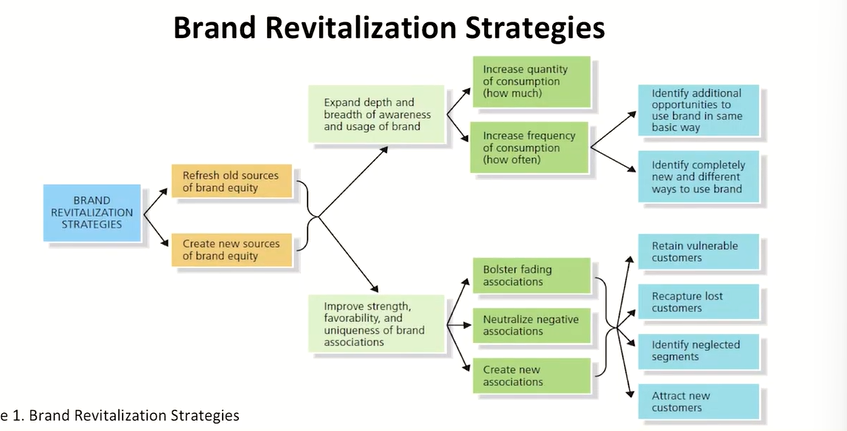
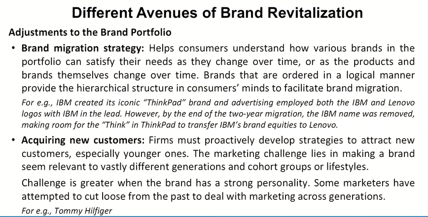
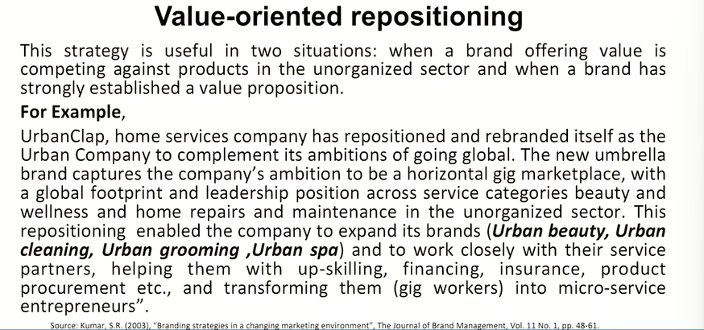
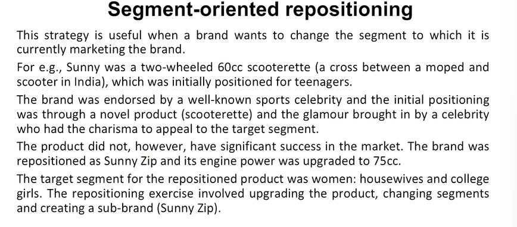
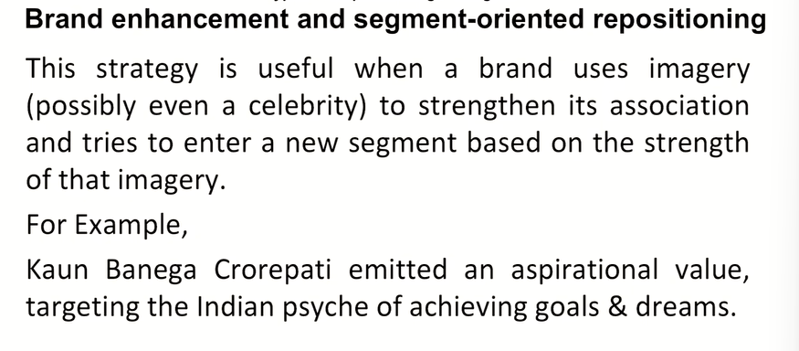
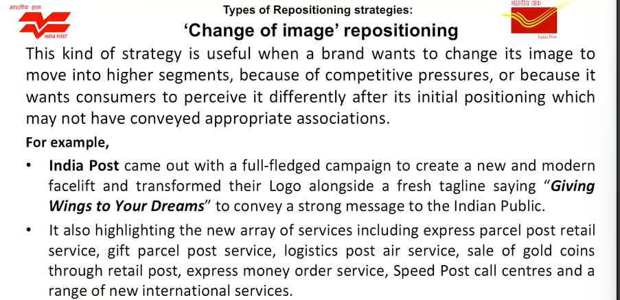
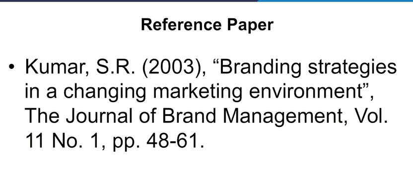

# Lecture 58: Brand Revitalization & Repositioning

## Brand Revitalization

* In virtually every product category are examples of once prominent
and admired brands that have fallen on hard times or even completely
disappeared.
* Some of these brands manage to turnaround and come back. For e.g.,
Readers Digest, Cuticura, Kelvinator etc.,
* Brands sometimes have to return to their roots to recapture lost
sources of equity.
* Brand revitalization is the strategy to recapture lost sources of brand
equity and identify and establish new sources of brand equity. This
may include product modification or brand repositioning.


* Brands on comeback trail needs revolutionary changes rather than
evolutionary changes.
* Brands most likely to respond to revitalization efforts are those that
have clear and relevant values that have been left dormant for a long
time. They still have lot of Brand equity left in them. **For e.g., NOKIA**
* Revitalizing deals with such brands which are old but if redirected may
have plenty of life.
* This can be substantially less costly and risky than introducing a new
brand.

## Brand Revitalization Strategies



## JAWA

## Different Avenues of Brand Revitalization

* **Identifying additional or New Usage Opportunities**
  * Make the use easier (Induleka Oil, Indica Hair dye shampoo)
  * Provide Incentives
  * Position for frequent/regular use (Clinic shampoo)
  * Increase the quantity use (Insurance customer reminded to cover more items)
* **Entering New Markets and New target segments**
  * The target market for a particular brand may not comprise of all the market segments.
  * If the firm may not have other brands for these target market segments, then they become potential areas for the brand to expand.
  * For e.g., LG enter to Portable AC, Small Refrigerators, **Van Heusen** to women clothing.

* **Identifying New and Completely different ways to Use the Brand**
For e.g., Milkmaid, Mayonnaise
* **Repositioning the brand**
  * A common problem for marketers of established, mature brands is to make
them more contemporary by creating relevant usage situations, a more
contemporary user profile, or a more modern brand personality.
  * Updating a brand may require some combination of new products, new
advertising, new promotions, and new packaging.
  * For e.g., To revive **Brylcream** Gel was launched, a clear gel with newer
packaging to impress younger audience.

* **Changing Brand Elements**
  * One or more brand elements are changed either to convey new information or
to signal that the brand has taken on new meaning because the product or
some other aspect of the marketing program has changed.
  * Brand name is typically the most important brand element.
  * It is easier to change other brand elements especially if they play an important
awareness or image function.

### Retiring brands

First step in retrenching a fading brand is to  
reduce the number of its product types. This  
reduces the cost of supporting the brand and  
allows it to concentrate on its strength so it can  
more easily hit profit targets.  



## PARKER PENS

## Brand Repositioning

* Brand positioning has been defined by Kotler as "the act of
designing the company's offering and image to occupy a
distinctive place in the mind of the target market". [1]
* Brand repositioning, in simple words, is the act of intentionally
switching the way your brand is perceived by customers. If
customers already have an opinion about your brand, brand
repositioning is how you adjust perceptions, so they better
reflect your brand's true mission, style, promise, and purpose.

## Rationales for brand Repositioning

1. The identity/execution was poorly conceived.  
   Can often be identified by measures of consumer interest, brand associations sales.

2. The target of the identity/execution is limited.  
   May need to change to reach a broader market.

3. The identity/execution has booking out of date.  
   Markets change such that a working position may become obsolete.

4. The identity/execution loses its edge, becomes old fashioned.  
   Consumers and markets change such that positions/executions that were once
contemporary became less so.

5. The identity/execution has just become tired.  
   Same overtime may become boring to consumers. Losing ability to attract attention


## Types of Repositioning Strategies

1. Value-oriented Repositioning



2. Segment-oriented Repositioning



3. Brand enhancement and segment-oriented Repositioning



4. "Change of image" repositioning



## Reference Paper



```txt
Neither the sentiments of the older customers
should be heard nor the belief of the future
customer.
About what your brand meant should be
dismantled because ultimately we are thinking
in terms of brand loyalty and brand equity.
You see rejuvenating sales is not the only
objective when we thinking think in terms of
brand management.
Generating brand equity, brand loyalty and
subsequently the sales associated with all the
products associated with that particular brand
is the main important key.
```

## Examples

· Gillette  
· KFC  
· Bata  
· IBM  
· Asian Paints  
· STAR TV  
· Lufthansa  
· KLM  

```txt
Now Gillette, when came up with Gillette
Guard, they sort of repositioned themselves
without saying that they are repositioning
themselves and that is, that is an important
thing. You see. Did we realize that? No. They
retained their older customers or sentiments
of the older customers and did not dismantle
the belief of the customers which they have
gained now that they are Gillette and that is
where branding intelligence comes in.
```