# Lecture 60: Product & Brand Management- Conclusion

## Timeline of Patanjali's journey

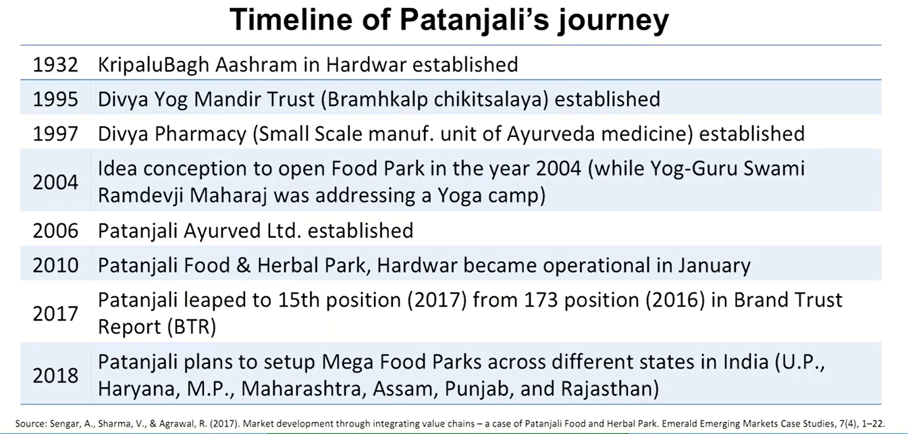

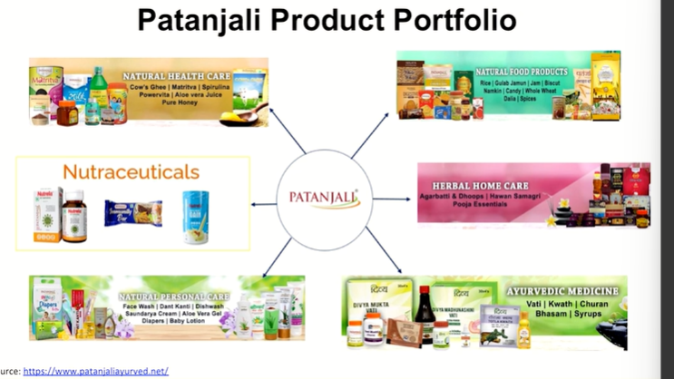

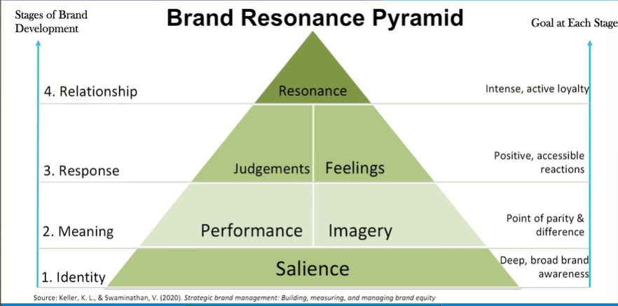

## Patanjali Customer based Brand Equity

* **Brand Salience:** Patanjali's products as natural with Ayurvedic
properties, & the products are generally used by people who are health
conscious and relate it to their healthy lifestyle. Along with this, the trust and faith of people in Yoga and Swami Ramdevji Maharaj made the path
easier for "Patanjali" to seize the opportunity with the slogan **"Prakriti ka Ashirwad."**
* **Brand Identity:** PAL followed three philosophies when it introduced any product in the market. These included **Swadeshi products** (manufacture in India), **Ayurvedic products (Natural & Herbal)** (no chemicals, preservatives, etc.) and products with value proposition around **wellness and nutrition** brand in the market through which it was able to create a **perception about the brand in the mind of consumers.**

* **Brand Imagery:** The brand attributes, such as creating quality image, the
products being sourced naturally, being purely herbal, and the portrayal of the
brand as totally ayurvedic in nature along with suitable pricing strategies
created a clearcut point of parity in the mindset of customers comparing the
competing multinational brand offerings.
* **Brand Performance:** PAL were able to keep their promise as they followed the
Ayurveda principle, which did not believe in profiting from the patient care;
employee salaries were modest, and the company administrative costs were
kept as low as 2.5 per cent as compared to most other competitor companies
that had administrative costs of 10 per cent. This helped PAL to provide
product at reasonably low price compared to the competitors and the product
efficiency created a positive word of mouth.

* **Brand Response:** PAL were able to build an emotional connect
with the audience with their product positioning and Swadeshi
campaigns. Swami Ramdevji Maharaj, in his yoga sessions and
discourses, narrated various aspects such as the importance of
products made in India, effects of chemicals on the health,
potential benefits to farmers, etc. and his campaigns to promote
Natural and Herbal brought in a **brand feeling** among the
consumers. Furthermore, customers who were expecting the
quality and price offered by them and the early adopters of
Patanjali grew in number through strong word-of-mouth publicity
for their products **(brand judgments).**

* **Brand Resonance:** Patanjali has grown exponentially
with in a short span of time which is the result of
around 20 years of rigorous hard work around Yoga
and Ayurveda by the founders. In those 20 years, they
have built an extremely loyal community. Furthermore,
with their digital presence felt across various digital
media have more than 100,000 followers on twitter
and more than 5.7 million likes on Facebook page. PAL
embraced real-time digital marketing strategies.

## Patanjali Sources of Brand Equity

* Brand Awareness: Brand awareness consists of brand recognition and
brand recall performance:
    * Brand recognition: In case of Patanjali, the customer is able to
recognize the brand, displayed in a store, based on actual
experience or consumption of its products.
    * Brand recall: The positioning of Patanjali, as a natural product
remains in the customers mindset. And the slogan **"Prakriti ka
Ashirwad."** also has increased this perception in their mindset.
    * Brand Image: Consumers perceive Patanjali's products as natural
with Ayurvedic properties, & the products are generally used by
people who are health conscious and relate it to their healthy
lifestyle.

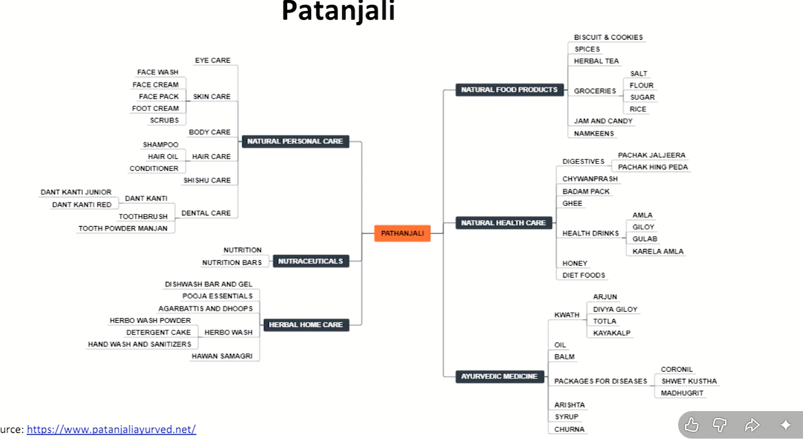

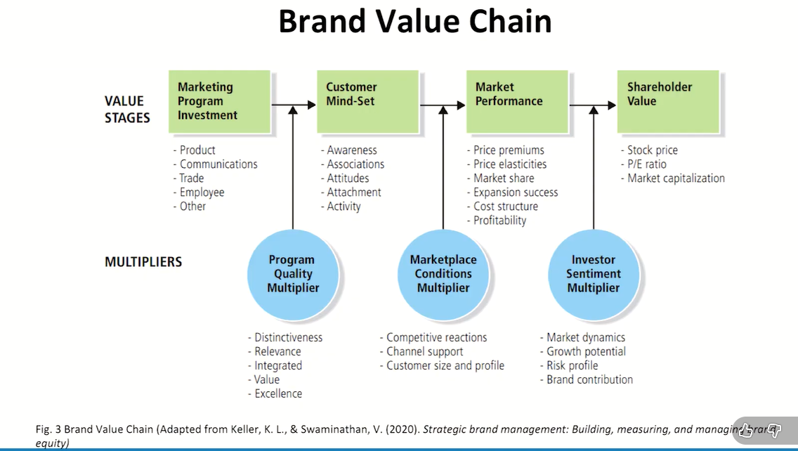

## Marketing Program Investment

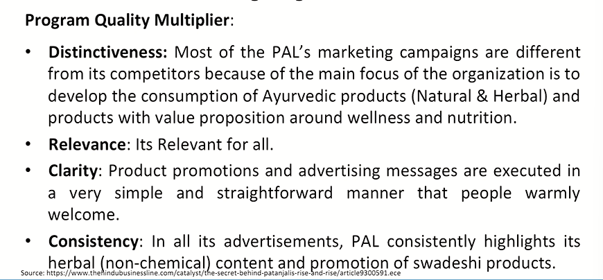

## Customer Mindset

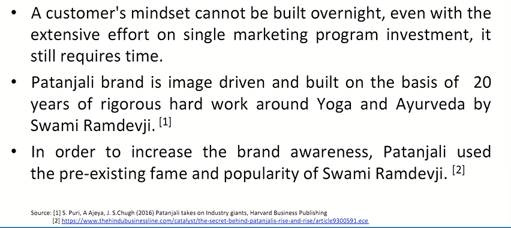

* Patanjali products are promoted as herbal, organic and
Ayurveda based products. **(Associations)**
* Consumers buying the product feel that they are moving towards
a natural product which is good for the health and
for the environment. The brand also is of Indian origin which elates the
customers. **(Attachments)**
* Patanjali targets the rural market at first and uses the word-of-
mouth publicity to good effect. The image of Baba Ramdev is used
to reinforce the association of organic and healthy product. **(Activity)**

## Marketplace conditions multiplier

* Rather than going with wholesaler-distribution and retailer model, PAL has
adopted a franchisee business model to sell its products. Patanjali
Chikitsalayas, the health and wellness centers like Patanjali Arogya Kendras,
non-medicine outlets like Swadeshi Kendras, along with well-known retail
chains, general retail stores, and a huge number of exclusive retail outlets
thousands in number across India constitute PAL's distribution channels.
* PAL trains and certifies medical practitioners nominated by these stores. In
return, the stores provide free consultation service to its customers by the
certified medical practitioners. This increases the likelihood of building large-
scale early adopters. As the stores stocks both the pharmaceutical and FMCG
products, cross-selling happens, and the early adopters bring in additional
footfalls through strong word-of-mouth publicity. (Channel Support)

* PAL created new markets and segments of consumer. These consumers
were interested in organic, herbal and ayurvedic products. For example,
the growth of herbal segment of shampoo doubled to around 194
percent in early 2016.
* Many of the competitors also started focusing on herbal and organic
variants. **(Competitive Reactions).**
* PAL after initially spending less on advertisements especially on the mass
media advertising like Television and News papers spent ₹3 billion to cater
to growing market needs in 2015. They started working with reputed
creative agencies like DDB Mudra and McCann while also roping in celebrities
like wrestler Sushil Kumar and Hema Malini. **(Customer size and profile).**

## Market Performance

* The company sourced raw materials directly from
farmers, which ensured better profitability and lower
costs for consumers. [1]
* **Market share:** Because of its rational pricing, Patanjali
achieved a good market share operating in various
categories, primarily honey, ghee, and ayurvedic
medicines. [1] Dant Kanti has achieved 11 % market
share (2018, Statista).
* Currently (2021), PAL is making 20 percent
operating profit which is higher than the industry
average. (Profitability).
* In 2016, Patanjali had entered the ranks of the
top 10 advertisers in India. By 2017, it was the
third largest ad spender in the country. Eighty
percent of those ads were played on Indian news
channels. [1]

## Investor Sentiment Multiplier

* The Indian FMCG sector being the fourth largest sector in the
Indian economy has grown considerably over the past decade.
Major FMCG companies were able to dictate the prices
through local sourcing with a backward integration with key
commodity suppliers or doing backward integration with the
local suppliers. **(Market dynamics).** [1]
* The Fast-moving consumer goods (FMCG) sector is India's
fourth-largest sector with household and personal care
accounting for 50% of FMCG sales in India. **(Growth
Potential).** [2]


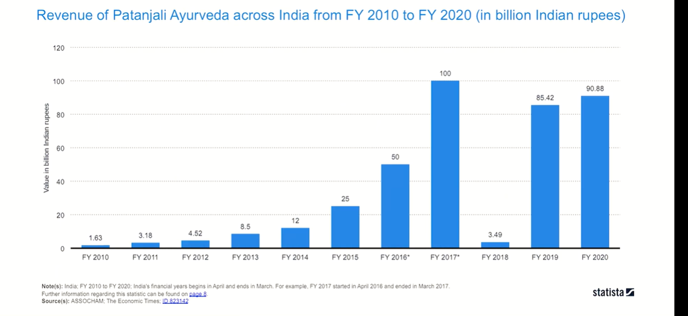

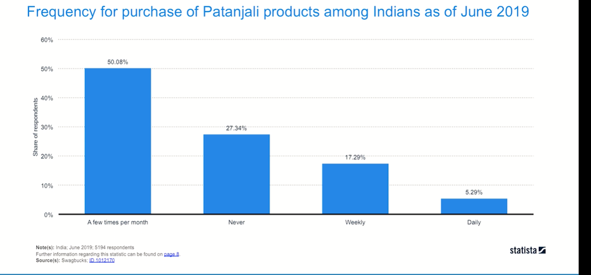

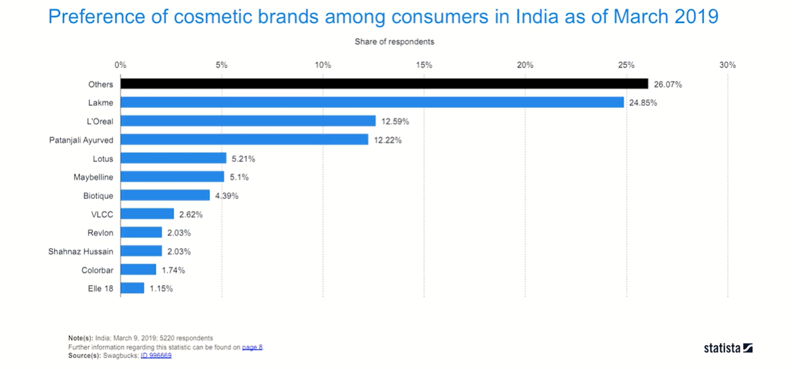

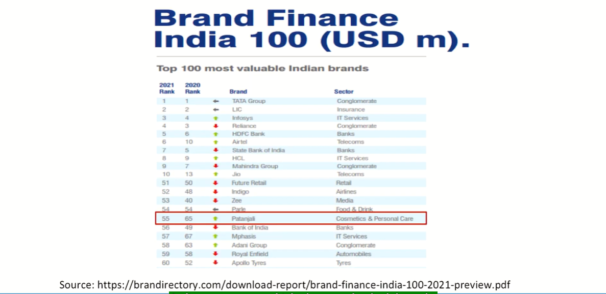

```txt
Thank you for being with me for so long. I
hope you have enjoyed this journey and I
hope that you will feel benefited out of this
discussion we have had. I will be always open
to all the queries you would send to me and I
will be happily, happily resolving everything
which I am capable of. Thank you. Goodbye.
```